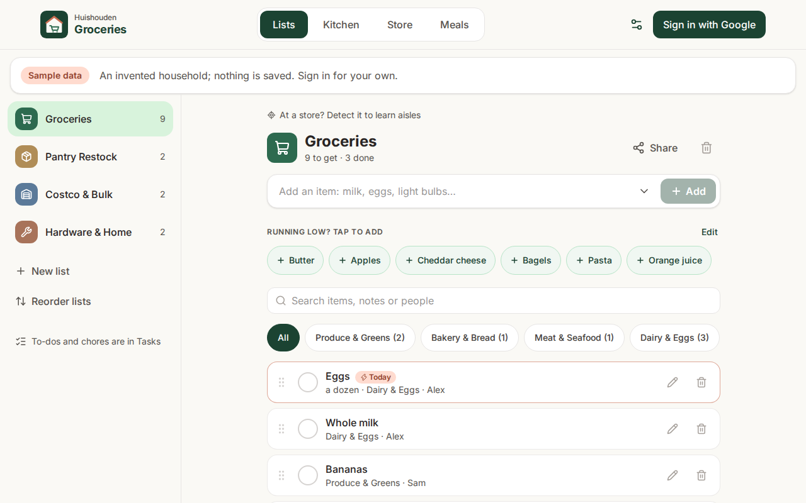
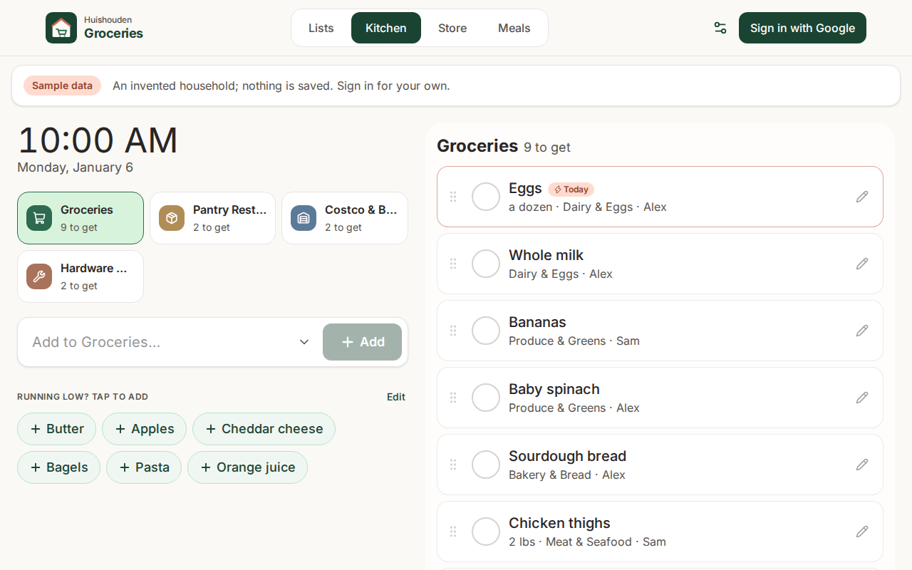
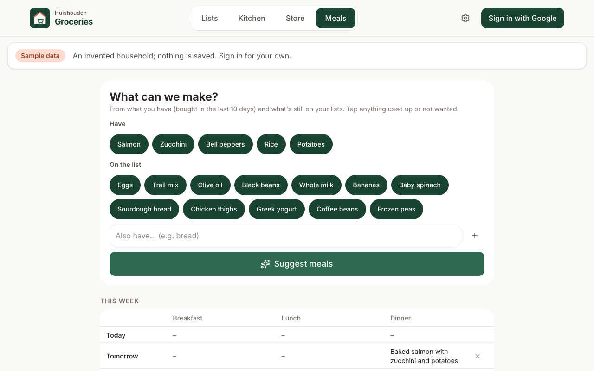
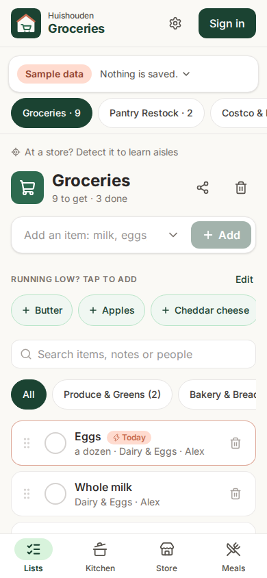
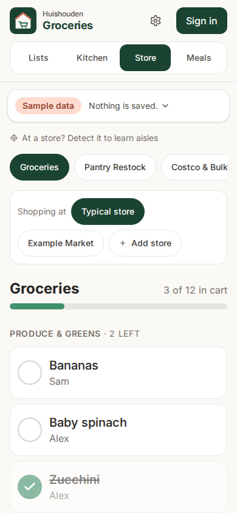

# Huishouden Groceries

What to get, and where it is. Shared shopping lists, a store mode that walks the aisles, and meal ideas from what was bought. Every device in the household sees changes in real time and keeps working offline.

Part of [Huishouden](https://huishouden-piekstra.web.app), a suite of small household apps that share sign-in, the household and one design language ([huishouden-pwa-kit](https://github.com/huishouden/pwa-kit)). Live at https://huishouden-piekstra.web.app/groceries/. To-dos and chores are in [Huishouden Tasks](https://github.com/huishouden/tasks), which reads the same household lists.

## Screens

| Lists (tablet) | Kitchen (always-on tablet) |
| --- | --- |
|  |  |
| **Meals** from what was bought | **Lists** on a phone |
|  |  |



**Store** mode on a phone walks the list in the chosen store's order, what is left first: checked items sink to the bottom of their section, and sections with nothing left fold into one "In cart" group at the end, which opens to un-check something. With a single shopping list there is no list picker. In a shop, a one-line banner asks whether you are at the store it found nearby (OpenStreetMap). The household's saved stores are listed nearest first with their distance: from where you are when location is allowed, otherwise from the household's home (set in the portal); the banner itself only ever uses the device's own position. While shopping, checking an item off offers an optional "which aisle?" at the bottom of the screen; aisles are remembered per store for the household, items are then grouped by aisle, and a wrong aisle can be corrected from the item. Each section's heading stays at the top while its items scroll by.

At a store, each item has a "Find at Publix" link that opens the store's own website search (or its app, where the store's app takes the link) with the item's name filled in, quantities and notes left out, so the store can say which aisle it is in. The stores whose search is known are in `src/data/chains.ts`, each checked in a real browser; any other store gets a web search for the item and the store's name. With no store picked, an item's details offer the household's saved stores, nearest first.

Signed out, Groceries opens on an invented household (`src/data/demo.ts`): the real app on a Firestore that never goes online, so it can be tried without an account and nothing is saved. The screenshots are of that household; CI refreshes them after every deploy (`bun run screenshots`) and posts before/after images of the same scenes on every pull request.

<br clear="right">

## How it works

- **Lists:** the household's lists (`households/{id}/lists` and `items`) are shared with Huishouden Tasks. A list's icon decides whose it is: chores and notes lists are Tasks' to-do lists, every other list (groceries, pantry, bulk, hardware) is a shopping list here (`isTaskList` in `src/data/model.ts`, the same in both apps). A new household starts with lists for both apps, whichever app creates it.
- **Sign-in:** Google accounts through Firebase Auth, in the suite's app bar (`@huishouden/pwa-kit/react/app-bar`), and silently (One Tap) when the browser is already signed in to Google. A household is a list of member emails shared by every Huishouden app; anyone in it can see and edit every list. Members are added in Huishouden or in Settings.
- **Data:** Cloud Firestore, cached on each device so the app opens instantly and works without a connection. Access is enforced by the household's Firestore rules, which live in [huishouden/rules](https://github.com/huishouden/rules); changes to what Groceries stores go there as a PR.
- **Staples:** every item added to or bought from a Groceries list is counted by name (`staples`), so the add bar suggests the household's usual spelling, section and quantity, and the shelf under it offers what is bought often. Any suggestion can be dropped: a long press (or right-click) on a shelf chip opens "Don't suggest …", Edit by the shelf's heading puts an × on each chip, and each add-bar suggestion has an ×; Undo puts it back. Chores learned when Tasks and Groceries were one app (filed under Chores & Tasks, or named like an item on one of Tasks' lists) are never suggested (`shoppingStaples` in `src/data/model.ts`).
- **Household calendar:** planned dinners are published to the household agenda (`@huishouden/pwa-kit/agenda`, app `groceries`), so the Huishouden portal's Calendar and Today show "Dinner: …" with a link back to Meals. Any open device keeps it in step a few seconds after a change (`src/data/publish.ts`).
- **Google Tasks:** something told to the Gemini app or Google Assistant ("add eggs to my list") lands in Google Tasks. In Settings a member connects Google Tasks (read-only, `@huishouden/pwa-kit/google-tasks`) and chooses which Google list feeds which shopping list (`households/{id}/settings/tasks`). New tasks there are added straight away, under a fixed id so two devices never add one twice. Huishouden Tasks keeps its to-do lists' links in the same document: Groceries names them, leaves them as they are and never brings those tasks in. Groceries looks when it opens or comes back into view, only with a token the device already has, so for an hour after someone connects on that device; taken-in task ids are kept so a cleared item does not come back.
- **Writes:** through the kit's outbox (`@huishouden/pwa-kit/firestore`), so an item added just before the app closes is not lost.
- **Hosting:** the suite's one site, `huishouden-piekstra`, under `/groceries/` (pwa-kit [docs/one-site.md](https://github.com/huishouden/pwa-kit/blob/main/docs/one-site.md)); `huishouden-groceries.web.app` redirects there.
- **Config:** CI builds read the Firebase web config from the repo's `VITE_FIREBASE_*` variables (public by design); local previews fall back to `/__/firebase/init.json`, which Hosting serves.
- **Updates:** every push to `main` runs the checks and deploys. Installed copies pick up a new version on their next launch, and the always-on tablet checks hourly.

Four layouts share the same data: **Lists** for managing everything, **Kitchen** for the always-on tablet (large targets, screen kept awake), **Store** for checking items off aisle by aisle, and **Meals** for meal ideas and the week's plan.

**Meals** asks Gemini (through Firebase AI Logic, on the free Gemini Developer API tier) for breakfast, lunch, dinner and snack ideas built from groceries checked off in the last 10 days and what is still on the lists, within the household's food preferences (who eats at home, diets, spice; set in the Huishouden portal, `@huishouden/pwa-kit/food`). The prompt, response schema and model live in `src/data/menus.ts`. Every suggested ingredient is checked in code against what was bought plus a short list of kitchen basics, and meals that use anything else are dropped. Saved ideas and starred favorites are shared with the household, and any idea can be planned for a day this week. AI Logic only accepts requests carrying an App Check token (reCAPTCHA Enterprise), so the API cannot be used from outside this site.

## Privacy

Household data lives in the household's own Firestore documents, visible only to its members.
To catch problems early, the app sends reports to New Relic (free tier) through
`@huishouden/pwa-kit/observability`: errors (emails, ids, query strings and long numbers removed),
Core Web Vitals and page loads, the app version, device type, and the country and region New Relic
derives from the request; and anonymous usage counts per visit: `add item`, `check item`, `clear completed`, `create list`, `add store`, `note aisle`, `save meal ideas`, `save favorite meal`, and which view is open. Households are counted by a
hash of the id. No names, emails, entries, free text or precise location, and no cookie or stored
id: nothing links one visit to the next. When the browser sends Global Privacy Control or Do Not
Track, usage counts are skipped; errors and speed still go. Local builds, staging and automated
browsers send nothing. The page people see is
[huishouden-piekstra.web.app/privacy](https://huishouden-piekstra.web.app/privacy); details in pwa-kit
[docs/observability.md](https://github.com/huishouden/pwa-kit/blob/main/docs/observability.md).

## Develop

Requires [Bun](https://bun.sh), and Java 21+ for the Firestore emulator. Ports differ from Tasks' (app 5176, Auth 9199, Firestore 8180, hub 4410), so both apps' tests can run at once.

```sh
bun install                        # also enables the pre-commit leak scan (.githooks)
sh e2e/emulators/fetch-rules.sh && bunx firebase emulators:start --config e2e/emulators/firebase.json --only auth,firestore --project demo-huishouden-groceries   # terminal 1
VITE_USE_EMULATORS=true bun run dev                                                     # terminal 2
bun run verify       # types, design check, unit tests, build
bun run e2e:local    # signed-in browser flows against the emulators (starts them itself)
bun run e2e          # smoke tests of the deployed site (read-only)
bun run e2e:ai       # real Gemini through the app's code (needs an App Check debug token, see below)
BASE_URL=http://localhost:5176/groceries/ bun run screenshots   # the README scenes of the signed-out sample household
bun scripts/menu-probe.ts "eggs, steak, rice"   # try the menu prompt against Gemini
```

`e2e:ai` and `menu-probe.ts` read an App Check debug token from `~/.config/huishouden-groceries/appcheck-debug-token`. Register one under App Check → Apps → Groceries → Manage debug tokens, and keep it out of the repo.

Against the emulators, the app exposes `window.__testSignIn(email, name)`, which `e2e/` uses to sign in; it does not exist in production builds. `e2e/fixtures.ts` has the shared helpers: emulator reset, sign-in, slow-network emulation, error capture, admin writes standing in for Huishouden Tasks, and a stand-in for OpenStreetMap.

## CI/CD and releases

`.github/workflows/ci.yml` calls the kit's shared pipeline (`pwa.yml`): leak scan, design check, lint, unit tests and build on every pull request and push; on `main`, the build is published as a release asset and the whole one site is deployed keylessly, then smoke tests run against `/groceries/`. Pull requests deploy to the staging project and run `e2e/signed-in.spec.ts` as invented test users (one member adds a grocery item, the other sees it). This repo adds `app-tests`: the signed-in browser flows against the Auth and Firestore emulators, using the current rules from huishouden/rules main (`RULES_REF=<branch>` tries a rules PR). Releases come from the kit's `release.yml` (release-please): Conventional Commit PR titles become `CHANGELOG.md` and tagged versions, and Settings shows the running version and build.

Deploys authenticate through Workload Identity Federation (no stored keys) with the repo variables `GCP_WIF_PROVIDER` and `GCP_DEPLOY_SA`, set by the kit's `infra/bootstrap.sh` from the portal's `apps.json`.

## History

Groceries began as the shopping half of Huishouden Tasks. Its files were moved here with their history (`git filter-repo`); commit messages before the split refer to pull requests in huishouden/tasks.

## License

Source available under [PolyForm Shield 1.0.0](LICENSE): you may use, study and modify this code
for any purpose except providing a product that competes with Huishouden.

Huishouden and its logo are the project's brand; please don't use them for other products.
